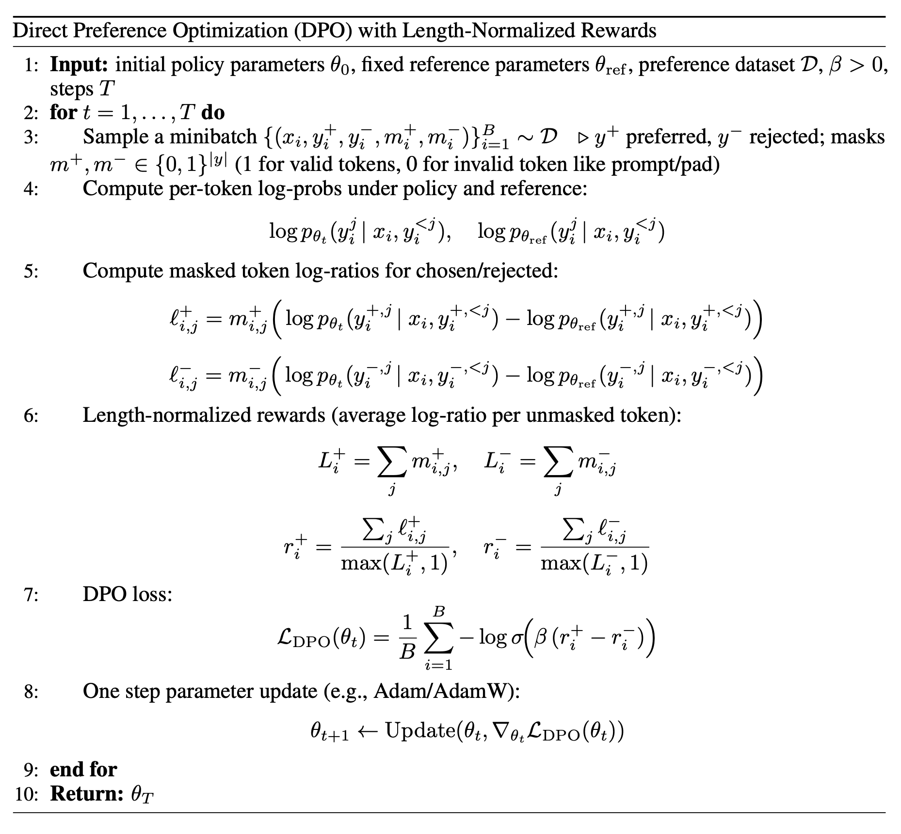

# Direct Preference Optimization (DPO)

This DPO variant computes the usual policy-vs-reference log-ratio, but instead of summing over tokens which can bias learning toward longer completions, it forms a length-normalized reward for each completion by averaging the masked token log-ratios over the number of supervised (unmasked) tokens. The loss is then the standard DPO logistic objective on the difference between the chosen and rejected rewards. In practice, the pseudocode "minibatch" corresponds to an effective batch assembled from micro-batches with gradient accumulation.

#### Implementation details

- **Data layout**: Chosen and rejected completions are interleaved in a single batch as `[chosen_0, rejected_0, chosen_1, rejected_1, ...]` via `torch.stack([chosen, rejected], dim=0)`. The input tensors are `[B, 2, T]` and reshaped to `[2B, T]` for the forward pass. Even rows (0::2) are chosen, odd rows (1::2) are rejected.

- **Reference model**: The reference model is initialized in `eval()` mode at construction and never updated. Its forward pass runs inside `torch.no_grad()`, and the ref logits are reduced to per-token logprobs `[2B, T-1]` immediately to free the full `[2B, T-1, vocab_size]` tensor from memory.

- **Log-probability computation**: Both policy and reference logprobs are computed via `CrossEntropyLoss(reduction="none")` in float32 (negated to get logprobs), avoiding bf16/fp16 quantization in the softmax.

- **Length normalization**: Token log-ratios are summed per sequence and divided by the number of valid (unmasked) tokens `max(L, 1)` for each completion independently. This prevents longer completions from having disproportionately larger reward magnitudes.

- **Tracked metrics**: Such as `loss` (DPO loss), `chosen_rewards` (mean length-normalized chosen reward), `rejected_rewards` (mean length-normalized rejected reward), `reward_accuracies` (fraction of examples where chosen reward > rejected reward), etc.

