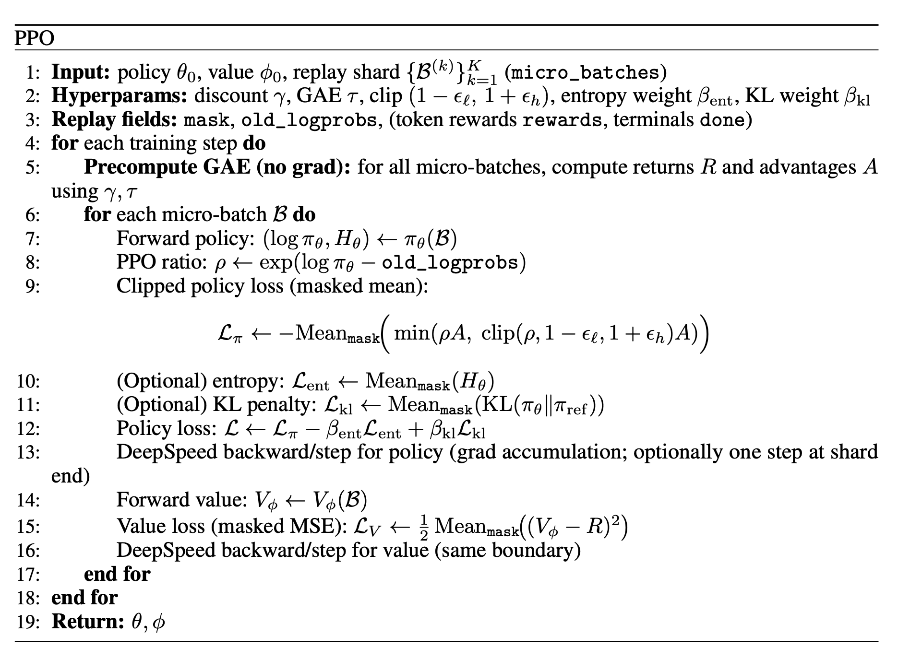

### PPO

 Our PPO training step (`train_step`) runs on a replay shard (a list of `micro_batches`) and uses DeepSpeed for micro-batching and gradient accumulation. Before any policy/value updates, we call `precompute_gae(micro_batches)`, which runs the value model in `eval()` mode and computes returns and advantages via `compute_advantages(...)` using `gamma` and `tau` (GAE). Then, for each `micro_batch`, we update the policy with a PPO clipped objective using stored `old_logprobs` and `mask`, plus optional entropy regularization (`ent_coeff`) and optional KL-to-reference penalty (`kl_coeff` if a reference model exists). We also update the value model by regressing `values` to the precomputed `returns` with a masked MSE. If `update_only_after_full_replay=True`, we take one optimizer step at the end of the replay shard (and scale losses by `ga_steps/num_micro` to keep gradient magnitude consistent.

 