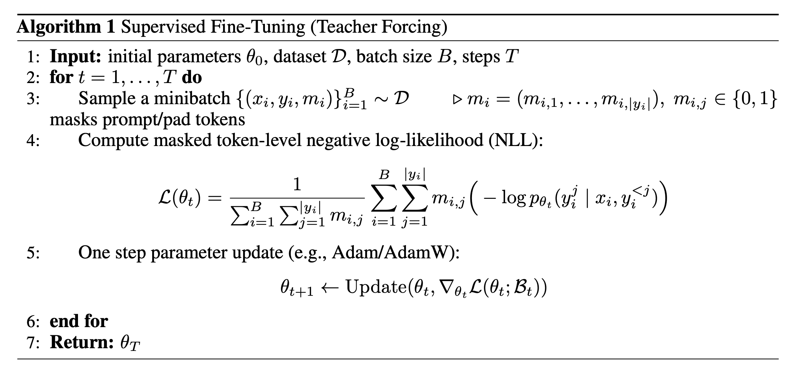

# Supervised Fine-Tuning (SFT)

The algorithm box summarizes what happens inside 'train\_step' during Supervised Fine-Tuning (SFT) with teacher forcing: for each training iteration we sample a minibatch, compute the (masked) token-level negative log-likelihood over the supervised tokens (typically the response, excluding prompt/padding), and apply one optimizer update (e.g., AdamW). In the actual training code, we run SFT with  DeepSpeed, so a minibatch in the pseudocode corresponds to an effective batch formed by splitting data into micro-batches and using gradient accumulation (and, depending on the configuration, ZeRO partitioning). We keep the algorithm box intentionally simplified for readability as the underlying implementation performs the same objective and update, just executed across micro-batches and distributed workers before producing a single logical parameter update.

