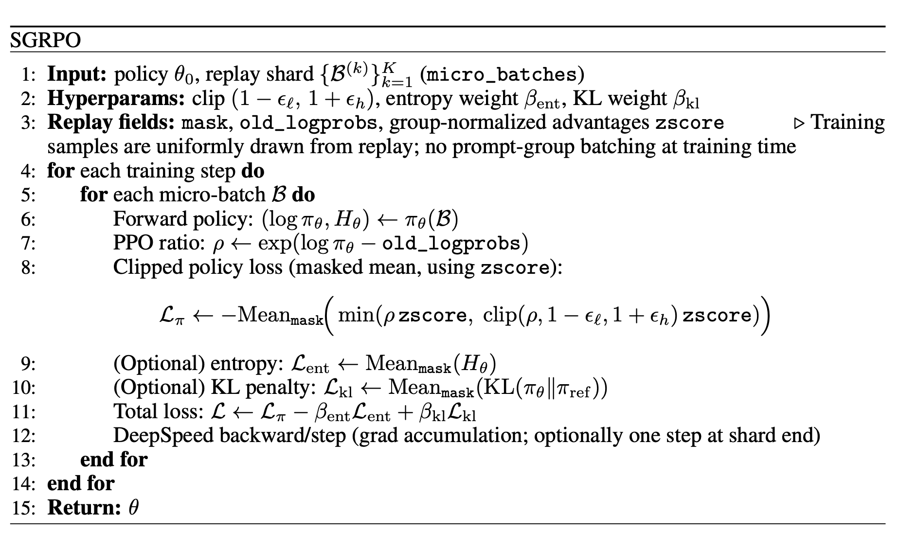

### SGRPO (our implementation)

SGRPO is a PPO-style update trained from a replay buffer. During rollout, for each prompt we generate multiple completions and compute group-normalized advantages (e.g., z-scored rewards within the set of completions for the same prompt). These advantages, along with the corresponding old policy log-probabilities (`old_logprobs`) and a token mask (to exclude prompt/padding), are stored in the replay buffer.

At training time, we do **not** construct batches that keep all completions of the same prompt together. Instead, we **uniformly sample** from the replay buffer, so each (micro-)batch contains a mixture of tokens from many prompts and many generations. For each micro-batch we run a forward pass under the current policy to obtain token log-probabilities, form the PPO ratio, and apply the standard clipped surrogate objective using the stored advantages. Optionally, we add an entropy bonus and an optional KL-to-reference penalty implemented in a variance-reduced form.

We do this replay-style, uniform sampling for two practical reasons. First, it makes the training loop more flexible in how batches are constructed: groups do not need to be materialized explicitly during training, and we can easily support variable numbers of samples per prompt-group. This is also convenient when rollouts contain duplicates (e.g., a group where multiple generations collapse to the same completion for a prompt), since we can ignore or down-weight such samples directly during generation without restructuring group batches. Second, optimizing over an uniform samples from replay buffer rather than only the current set of grouped completions tends to improve stability, because each update is informed by a broader, more diverse mix of recent experiences.

#### Difference vs official GRPO-style implementations

Common GRPO implementations typically build each training step around prompt-groups: start from a batch of prompts, generate G completions per prompt, and compute normalization (advantages/scaling) within each group (across the G completions for the same prompt). Training batches therefore preserve group structure by construction.

In contrast, our SGRPO uses uniform sampling from replay buffer, so training batches are not group-structured (even though the stored advantages are computed using per-prompt group normalization at rollout time). This changes the update statistics: instead of operating on a self-contained set of completions for a prompt, each update is driven by a mixture of replay samples across many prompts.

#### `update_only_after_full_replay=True`

This flag does **not** change sampling as we still sample uniformly from replay. It only changes the **optimizer step boundary**:

* If `False`, we step according to DeepSpeed gradient-accumulation boundaries (typical micro-batch accumulation).
* If `True`, we accumulate gradients over the entire replay shard and apply **one optimizer step at the end** (often with a scaling to keep gradient magnitude comparable).

 